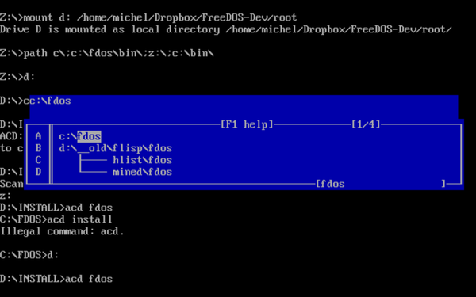
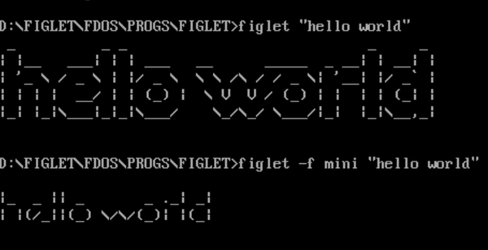
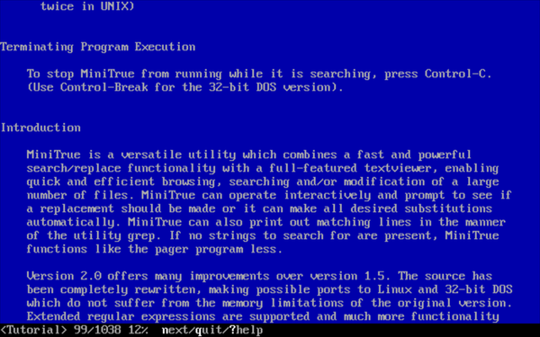
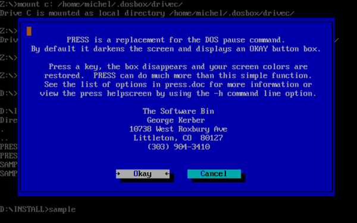
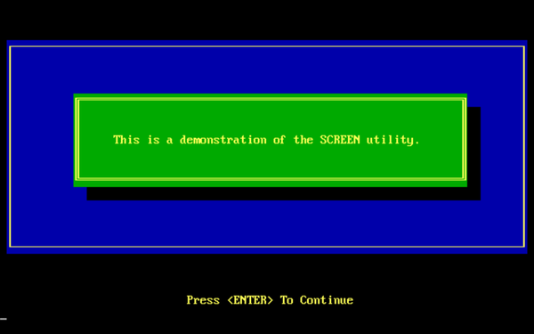
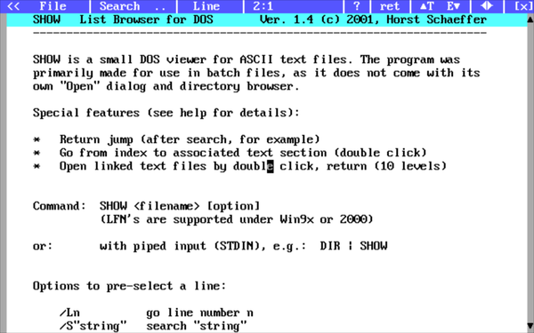
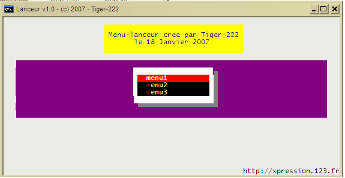

# Command-line utilities

-----

{: style="text-align:center"}
For installation instructions, please [return to General Index](README.md)

-----

Most of these will end up in C:\FDOS\BIN.

**Please note** that there are only so many filenames available when you have just eight characters to play with. You may already have a utility with the same name. If UNZIP asks whether to overwrite a file, think very carefully whether you want to use this file rather than the default FreeDOS one. I have tried to weed them out, but I may have missed some, and future versions of FreeDOS will no doubt contain more UNIX CLI ports.

+ [1DIR Pro](./zip/1dir.zip) 2.1 - It's DIR...on steroids.
    + Powerful color dir command with LFN support.
    + Files can be located using multiple patterns along with size, date, or attribute filtering.
    + Displays the size of subdirectories.
    + Generates batch files which perform commands on each file listed.
    + Auto detects number of rows.
    + Subdir searching and redirectable output.
    + Fully customizable!
    + Shareware. 

+ [ACD](./zip/acd.zip) - Another Change Directory.
    + Freeware by Kevin Solway.
    + ACD is used to switch quickly between directories across any drive. You simply invoke ACD and give it the full or partial name of the directory you wish to change to.
    + For example, if you have a directory named D:\COMM\KERMIT you could switch to this directory with the command ACD KER
    + ACD will first try to do an immediate change to the directory name that you specify.
    + If that change works, ACD simply exits immediately. If it fails, then ACD looks into your directory database and tries to figure out the directory name that you wanted.
    + If more than one directory existed with the same partial name that you gave to ACD, it will display a pop-up window on the screen containing all of the matches found.
    + Simply use the movementkeys (PgUp, PgDn, Home, End, Arrow keys) to highlight the directory that you want to change to, then hit ENTER.



+ [ANTIWORD](./zip/antiword.zip) - Extract text and (hopefully) images from a Microsoft Word .doc (not .docx) file.
    + GNU GPL v2 licensed.

+ [BATPOWER](./zip/batpower.zip) v3 - CLI utilities by various authors. Please see \FDOS\DOC\BATPOWER for more info on each command as well as the author's details and licensing conditions.
    + 4DIRSIZE - find out how much disk space directories use up.
    + ADJFDATE - Adjust the creation date of files by a specified number of days.
    + ANSWER - Ask a question, store response in environment variable.
    + BFC - Compares binary files in the same way as the DOS command "FC /B" but much faster.
    + BLACKOUT - No CONFIG.SYS/AUTOEXEC.BAT screen output.
    + BOX - Like ECHO but with a single-line box around the text. To do the same thing with a double-line box, use DBOX instead.


+ 
    + BROWSE - A very simple text file pager.
    + DATRANGE - Returns errorlevel 1 if system date falls within a specified range of dates.
    + DO - combine dos commands on a single line
    + FLIP - set capslock, numlock etc.
    + FORK - Redirect output to both the screen AND a file.
    + FPATH - locates the directory of an executable file the same way that COMMAND.COM would do - searching in the current directory first, and then in each directory of the PATH variable. Use to check that a utility exists on a user's system.
    + FULLDATE - Display the "full" current system date (i.e. Wednesday, January 1st, 1986).
    + HHMM - Displays the system time as HH:MM, *without CrLf*, in 24 hour format.  You can thus pipe it into files: *HHMM.com >> MyFile.Txt*. For the system date, use YYMMDD instead.
    + IFNUMBER - The FreeDOS command "if" can not do numeric predication like bigger than, smaller than, and so on. IFNUMBER can.
    + INPUT - Get console input from within a  batch file.
    + KEYPRESS - A non-TSR keyboard stuffer. Note that programs like this may not work in graphics mode.
    + MPAUSE - Like PAUSE, but mouse-aware.
    + NUKE - DELTREE on steroids. BE CAREFUL with this one!
    + PAWS - like PAUSE, but with your own message
    + POPDIR - return to PUSHDIR location.
    + PUSHDIR - Memorize current directory.
    + QEM - Quotes in the style of E-mails by prefacing the '> '  mark to the start of every line in a text file.
    + QUERY2 - set up multiple possible responses, store result in errorlevel
    + REBEEP - Noisy version of PAUSE
    + REN2DATE - Rename file to today's date
    + REN2NUM - Sequentially rename files to a numerical pattern.
    +  SETCOLOR - Set and/or reset the foreground and background colors.
    + STV -  Smooth Text Viewer for DOS. 100% assembly code, and runs fast!
    + TEST - returns true or false according to a conditional expression.
    + TESTIF -  Tests the system and returns dos error codes that can be used to control the execution of .BAT files.
    + TIME12HR - Display the current time as a "normal" 12 hour display (i.e.  15:10:49  is displayed as  3:10:49 p.m.)
    + TODAY - Display the "full" date and "12" hour clock on the same display line.
    + TUNE - Play one of five tunes on PC Speaker.
    + TXT2HTM - Convert a text file to a basic HTML page.
    + UX2DOS - Convert Unix-style text files (LF) to DOS Format (CR+LF).
    + WAITTIME - Pause PC until a specified time is reached.
    + XRAY - find text strings inside binary files. Alternatively use SRCH or RT.

+ [BATPOWER 2](./zip/batpwr2.zip ) v3 - DOS Commandline utilities by various authors. Please see \FDOS\DOC\BATPOWER for more info on each command as well as the author's details and licensing conditions.
    + AAVIRUS - A virus checker.
    + ADVSET - Advenced version of SET.
    + ALIGN - Aligns data in ASCII text files into neat columns.
    + Set foreground or background colors and do keyboard reassignment using ANSI driver for DOS (NANSI.SYS in FreeDOS).
    + ARC2ARC - Archive converter. Requires external de/archiving programs.
    + ASKME - A simple command line utility to use in batch files to prompt for Y/N questions, and have the DOS Errorlevel set on exit.
    + BCD - Create a fake CD-ROM drive.
    + BIGDIR - Scans an entire disk, and outputs the names and paths of all the files larger than a given size.
    + COM2EXE - convert .COM to .EXE files.
    + CTRLCAPS - Use Caps Lock as CTRL.
    +  DELAY - A simple program to replace the use of PAUSE inside of a batch file
    + FA -  A file analyzer that FA recognizes many
file packers, compilers, encruptors etc.
    + FIXCAPS - Fix Caps Lock to avoid tEXT tHAT lOOKS lIKE tHIS.
    + HEX - A little hex editor.
    + IDARC - Identify compressed files from within batch files.
    + MAKELOG - Create or append to log files.
    + MARK - Insert codes for system properties into an ECHO-like command.
    + MCOPY - copy multiple files that you cannot normally group with standard wildcards (* and ?), you just separate the files with commas
    + MDEL - A powerful program that allows you to quickly delete a lot of files.
    + MCOPY - move multiple files that you cannot normally group with standard wildcards (* and ?), you just separate the files with commas
    + PAYDAY - a CAL workalike that prints a calendar for the current month with today's date noted with an asterisk.
    + PCOPY - Search your PATH variable for a filename and copy it to a destination.
    + PDF2TXT1 - Extract text from PDF files. Required GZIP. 
    + PNGCRUSH - reduce size of PNG files.
    + SHF2GL - Two tiny programs to make the shift keys "sticky," i.e., make them toggles instead of having to be held down.  LSHIFTGL works on left shift, RSHIFTGL on right shift.
    + SPACE - get data and a bar graph on available disk space.
    + SWAP - switch two files.
    + UDATE - Displays the date and/or time in any format, including the current timezone.

+ [BATPOWER 3](./zip/batpwr3.zip) v1
    + ALLFILES  - Displays all files in the current directory, even if they are hidden
    + ASKASCII - Gives ascii codes of characters.
    + BCHKDSK  - Shows disk information.
    + CAPTURE - A non-TSR screen capturing utility.
    + CDESC - creates a neatly formatted descriptive list of specified files.
    + CDX - Provides an alternative to the DOS CD command that eliminates the need to enter long pathnames.
    + COMPACT - An enhanced 132x43 screen mode. Undo it with the normal MODE commands.
    + COMPOSE2 - A MOD player. Untested.
    + DIRSIZE - Calculates the size of a directory.
    + DPIC - Display bar graph of sisk usage.
    + EXECDIR - Shows the executables in a directory.
    + FILESIZE - Shows the filesize of a file.
    + FREE - Shows number of bytes free of a disk.
    + JPGCLEAN - Utility to clean up JPG graphics.
    + LF2CRLF/CRLF2LF - Converts UNIX text files to DOS text files and vice versa.
    + MM - A multimedia player.
    + MOREMEM - Display EMS and XMS status.
    + MULTIEXE - Allows you to run (other) programs that doesn't support wildcards * ? for files in their commandline options.
    + PRETZEL - A very simple screensaver.
    + RE-BOOT - A rebooting menu.
    + RENDIR - Renames a directory.
    + SCRNINFO - Get current screen mode info.
    + THISDATE - Get today's date.
    + UP2LOW - Makes all uppercase characters lowercase in a file.
    + VESAGIF - A GIF viewer.
    + XCODE - a bidirectional file encoder/decoder.

+ [BAT POWER 4](./zip/batpwr4.zip) v1
    + Autostop - provide option in Batch files.
    + BATLOOP - Set up the equivalent of a WHILE...WEND loop in DOS batch files.
    + COUNTDN - Launch any specified program (EXE, COM, or BAT) after a countdown of a specified number of seconds.
    + DRSCROLL - scroll text horizontally, anywhere on the screen.
    + EVAL - A general purpose command line calculator for performing many scientific & engineering calculations.
    + FCUT - versatile file splitter.
    + FDATE - batch-file date manipulation utility.
    + GE - Executable identifier program.
    + HTM2TXT.EXE - Converts an html document to text.
    + HTM_CAL - Create calendars in HTML format.
    + HTMLCR - Compress HTML text but leave it readable.
    + ISHTAR - Convert HTML into RTF format.
    + JUSTIFY - A text justification program to reformat ASCII text files.
    + LGFV - Archive viewer.
        +  You need no archivers themselves to view archives.
        + Archive will be correctly recognized regardless of its extension.
        + It recognizes 90 types of archive formats
    + MAKEIDX.EXE - Makes an html index of the current directory.
    + TXT2HTM.EXE - Converts a text document to HTML.
    + Z - a text/hex file viewer, with source code. Also available in 32-bit format as z32.


+ [BEEP](./zip/beep.zip) 1.4 - A small  DOS utility  that beeps  for a certain  time at a certain frequency.
    + Freeware by Quentin Christensen.
    + May try to overwrite other versions of BEEP.EXE, and BEEP.COM is also common. This one is worth it, though.

+ [BELIEF](./zip/belief.zip) - generate random religious beliefs.
    + Public Domain sofware (as far as could be ascertained) with additional data by Michel Clasquin-Johnson. See also [this page](https://clasqm.github.io/Belief/).
    + Compiled with *BCC* under *FreeDOS* 1.2
    + *Example output:*
````
The Arian Theosophist Sect suspects that Darwin's "Origin of Species"
if read backwards, reveals cryptic messages from the last practicing
medicine man of the Mohicans, and says that only the faithful will
achieve reincarnation.
````

+ [BFIND](./zip/bfind.zip) - Enhanced FIND command.
    + The BFIND.EXE program adds Boolean logic to DOS's FIND command.
    + Freeware for personal use by Bruce Guthrie.
    + See the LSM file for instructions.

+ [BLRMU](./zip/blrmu.zip) v22 - Bud L Rasmussen's Mini Utilities.
    + Freeware / Public Domain.
    + For more extensive descriptions of these utilities, see the appropriate .doc file for any specific utility.
    + Miscellaneous utilities
        + BCR - Batch Carriage Return
        + BEEP7 - Beep 7 times
        + BEEPN - Beep n times
        + BUK - Beep Until Keypress
        + CCC - Color Change Command
        + CLR - Clear the screen to color at x=0, y=0
        + CRSR - Cursor control
        + CRST - Cursor Reset
        + DAFEM - Display Available, Free, Extended Memory
        + DFM - Display Free Memory
        + DIV - Display Interrupt Vectors
        + DIVOP - Display Interrupt Vectors On Printer
        + FD - Find Directory
        + FF - Form Feed
        + GO - Go to drive + directory
        + JD - Jump Directory
        + LFD - Label Floppy Disk
        + PBM - Put Batch Message
        + PRT - Print multiple copies of text files
        + TO - change TO drive + directory
        + TONL - Turn Off Num Lock
        + TRAD - Typematic Rate And Delay
    + Tune playing utilities
        + BIRDCALL - Play 'Birds' call (intro to 'Parkers Mood')
        + ITAINT - Play 'It Aint Necessarily So'
        + KCBLUZ - Play 'KC Blues'
        + NEWBLUZ - Play 'New Blues'
        + OLDBLUZ - Play 'Old Blues'
        + RITES - Play intro to "Rites of Spring'
    + Screen color change utilities
        + BLUWHT - Clear screen to white on blue
        + BLUYLO - Clear screen to yellow on blue
        + BRNWHT - Clear screen to white on brown
        + BRNYLO - Clear screen to yellow on brown
        + CYNWHT - Clear screen to white on cyan
        + CYNYLO - Clear screen to yellow on cyan
        + GRNWHT - Clear screen to white on green
        + GRNYLO - Clear screen to yellow on green
        + MAGWHT - Clear screen to white on magenta
        + MAGYLO - Clear screen to yellow on magenta
        + REDWHT - Clear screen to wht on red
        + REDYLO - Clear screen to yellow on red
        + WHTBLK - Clear screen to black on white

+ [BLRUT](./zip/blrut.zip) - *Bud L Rasmussen's Utilities* 
    + 28 general purpose DOS utilities.
        + BD -- Backup Directory
        + BHD -- Backup Hard Disk
        + BLF -- Backup Large File
        + BLRUT -- Executable form of BLRUT55.DOC
        + CACF -- Copy And Convert File
        + CF -- Copy File
        + DBPB -- Display BIOS Parameter Block
        + DCM -- Directory Copy/Move
        + DDBT -- Display Disk Base Table
        + DKV -- Display Key Value
        + DPT -- Display Partition Table
        + DSE -- Disk Sector Edit
        + EADF -- Erase All Diskette Files
        + EBU -- Execute BLR Utilities (menu/shell)
        + FCM -- File Copy/Move
        + FFD -- Format Floppy Diskette
        + FRE -- File Record Edit
        + LPAF -- List/Print Any File
        + LPD -- List/Print Directory
        + LPS -- List/Print Sector
        + LPTF -- List/Print Text File
        + LTF -- List Text File
        + PSF -- Print Spooled File
        + QDL -- Quick Directory List
        + RLF -- Restore Large File
        + RSD -- Rename Sub Directory
        + SD -- Space Display
        + SLTF -- Split Large Text Files
        + TFC -- Two File Compare
        + VLCC -- Volume Label Change, Compare

+ [CHANGE](./zip/change.zip) - Find-and-replace from the command line.
    + Processes change commands in files.
    + Files can be of any size and type (binary or text) and are processed quickly.
    + Up to thirty change commands can be processed in a single pass.
    + Also provides ability to remove trailing spaces from text files.
    + Freeware by [Bruce Guthrie](bguthrie@doc.gov) / U.S. Dept of Commerce.

+ [DOSPDF](./zip/dospdf.zip) - PDF viewer.
    + An outragous hack by [Mateusz Viste "Fox"](http://mateusz.viste.free.fr/dos).
    + This crashes my DOSBox, but works (slowly!) on a real FreeDOS install.
    + Use it when the old Acrobat for DOS chokes on a modern PDF.
    + Requires the *CDD* command - everything else is included, even a working installation of Alladdin Ghostscript.
    + I've done the SETUP already and copied the resulting batch file into /FDOS/BIN, so it should be ready to run.

+ [DOSUtils](./zip/dosutils.zip) - freeware utilities by Jem Berkes.
    + ALLFILES - Displays all the files in a directory (including hidden and system) and their attribute values.
    + ASK - A batch file utility, similar to DOS 6's "CHOICE", that allows user input during batch processing.
    + BOING - A manually activated screen saver (bounces a ball around the screen).
    + CAPTR - Captures the current contents of the text screen (in colour) and save it to a file, which can be reloaded later or loaded into a text editor to show what was originally on the screen. Renamed from CAPTURE.COM to avoid conflict with a similar utility already in the repo.
    + COMPACT - Switches to the enhanced VGA screen mode which usually allows 132 columns by 43 rows of text (132 x 43).
    + COMPID - Locates and displays your computer's ROM-BIOS copyright message and date.
    + DDRAW - Lets you draw images on your screen from the DOS prompt. Requires a mouse and VGA monitor.
    + DIR2WEB - Reads a user-defined filespec (e.g. *.*) and creates an HTML index file.
    + DISKINFO - Tells you technical information about the current disk drive.
    + DPIC - Shows a bar graph representing disk space used and disk space remaining.
    + DSKREADY - Quickly checks (takes about 1 second) to see if a diskette drive is empty or has a disk in it. Returns errorlevels.
    + EXAMINE - Detects a program's exit method, memory usage, and return codes.
    + LPSTAT - The PC parallel port uses a practically direct I/O port to pin connection. LPTstat shows each bit's status in real-time, and includes the bit's location in the PC address space and its corresponding pin number on a DB-25 connector.
    + MED - Tells you whether you are currently in a "multitasking" environment (such as Windows or OS/2)
    + MOREMEM - Shows the status of installed memory managers (EMS and XMS).
    + PRETZEL - A manually activated screen saver (draws a pretzel like shape).
    + PRINTER - Checks to see if any of the printers attached to your system are powered and idle, and if so, displays a message on screen.
    + RE-BOOT - Reboots your computer with a warm, cold, or BIOS boot (this reloads the operating system). Accepts command line options or can present a menu.
    + SATS - An extended ATTRIB command for old DOS systems that can not otherwise access the hidden and system attributes.
    + SCREENEX - Lets you use the arrow keys to browse through the 256 screen modes. You can then stay in the mode you like.Renamed from SCREEN.COM to avoid conflict with a similar utility already in the repo
    + SCRNINFO - Gathers screen information - mode number and classification, number of screen rows and columns, and adapter segment.
    + SCRN - With a command line parameter, switches to one of 21 modes or displays the current mode. SCRN is similar to SCREENEX, but supports fewer modes.
    + SD2 - A command that will issue a print screen plus an "eject" command to your printer. Renamed from SD.COM to avoid conflict with a similar utility already in the repo.
    + SEQUENCE - Takes the files in the current directory matching a user defined specification (e.g. *.ZIP) and consecutively numbers them from 001 to a maximum of 255. Allows re-numbering provided that files are in proper order in directory.
    + SERIAL - Tells you which serial ports (COM) ports are installed, which are active, and if attached devices are ready or not.
    + THISDATE.EXE - Displays the current date by reading it from your system's clock. For example "Today is Tuesday, May 20, 1997". Not limited by the year 2000.
    + VALUE - Displays a key's ASCII value and scan code.
    + XCODE - Protects a file with a password by performing a mathematical calculation on each byte.
    + XREN - A file renaming utility that also allows you to move files to a different location on the same disk.

+ [Figlet](./zip/figlet.zip) - A program that creates large characters out of ordinary screen characters.



+ [GUTREAD](./zip/gutread.zip) -  read texts from the Gutenberg Project (or any other text file) and remove all the newlines saving hours of editing in your word processor.
    + It will also produce the text in XML format.
    + See the LSM file for instructions.
    + Another utility that does the same thing is [WPPREP](./zip/wpprep.zip) by Les Leist.

+ [INKUTILS](./zip/inkutils.zip) - A collection of utilities.
    + DD - Allows a directory (and its contents) to be deleted. Much more friendly than DELTREE
    + DEDIT - A full-screen 4DOS/NDOS/TakeCommand file description editor.
    + CC - A control panel for the SmartDrv (or any compatible) disk cache.
    + EE - A flexible calculator than can be used three ways: Command line calculator, Desktop calculator or TSR popup calculator. 
    + CE -  eplaces the standard "Retry, Ignore, Fail or Abort" message with a popup window that gives much more information on the error that has occurred.
    + TM - Allows various text modes (including any VESA text mode that your video card supports) to be selected.
    + LE - Displays only the executable files (EXE, COM, BAT and, if you're using 4DOS or NDOS, BTM) in the current or specified directory.
    + MCD -  Performs the DOS commands MD and CD in one go.
        + MCD can also create multiple directories in one go (e.g. MCD \one\two\three will create the directories \ONE, \one\TWO and \one\two\THREE).
        + It can also protect directories, so that Delete Directory cannot delete them.
        + MCD supports Windows 95 long filenames.
    + FM - Reduces the time taken for a program to reset the mouse.
    + DZ - Intercepts any "Divide overflow" errors.
        + PLEASE NOTE: DZ.COM has been renamed to DZ0.com for use in FreeDOS. This prevents a conflict with DosZip Commander.
    + IP - Provides a quick and easy way to see at once which TSR programs from the Inkutils are currently resident in memory.
    + INKUTILS -  A friendly, menu driven user guide covering each Inkutil with full instructions and examples.
    + Freeware by Mark Incley.

+ [MINITRUE](./zip/minitrue.zip) - A versatile utility which combines a fast and powerful search/replace functionality with a full-featured textviewer.
    + GNU GPL2 software by Andrew B Pipkin. 
    + Enables quick and efficient browsing, searching and/or modification of a large number of files.
    + MiniTrue can operate interactively and prompt to see if a replacement should be made or it can make all desired substitutions automatically.
    + MiniTrue can also print out matching lines in the manner of the utility *grep*.
    + If no strings to search for are present, MiniTrue functions like the pager program *less*.
    + Contains both 16-bit MT.EXE and 32-bit MTR.EXE versions.



+ [NCONVERT](./zip/nconvert.zip) 6.88 - Graphics converter and resizer.
    + Nconvert is the multi-format commandline image converter for Win32, DOS, OS/2, and other platforms.
    + Type "nconvert -help" for available options.  

+ [OZPACK](./zip/ozpack.zip) 1.3 - Great Australian utilities.
    + Shareware by Kevin Solway (other programs by Solway on this page have been explicitly declared to be freeware. This one has not).
    + I have removed MOVE, since it is already in FreeDOS.
        + ASCII - Simple ascii table displaying the decimal and hexadecimal equivalents of all ascii characters.
        + BEAUTIFY - Beautify thine writing! (complete with sexist language).
        + BIGTYPE - Create large and fancy lettering using only ascii graphic characters.
        + CMOS - Saves and restores the CMOS information on AT type computers (286 and above). 
        + CONVERT - Convert Wordstar format files to standard Ascii, Ascii to Wordstar, and Wordperfect format files to standard Ascii
        + ECALC - CLI inline calculator.
        + EXEMENU - Makes a menu (sorted alphabetically) out of the .EXE files (other than itself) found in same directory as itself.
        + FILEFIND - Finds all files matching a search pattern over a whole disk drive, and optionally moves to the directory of the located file.
        + FINDIN - Search for a string of characters within a standard text file and return with a DOS errorlevel value indicating whether the text has been found in the file.
        + FREE - This program gives a quick report of disk usage.
        + INFO - Provides basic system information, computer speed index and disk space information with diagram. 
        + INSTALL - Software installation with optional execution and uninstallation.
        + LIFE - This program models the processes of competition and selection in natural systems in a colourful graphic format. It will run in CGA mode on any CGA or EGA/VGA system.
        + LZEXE - Compressor for EXE files.
        + MAKECOM - Convert ordinary text files into self-displaying .COM files.
        + MYLIFE - Get a rough idea how many seconds you have left and see your life whittling away. 
        + PCAL - A simple picture calendar program.
        + PCXLIFE - Converts .PCX format graphics files into self-displaying executable programs that can be further compressed with the fabulous LZEXE. 
        + PEEPBO - A short and simple program to encrypt and decrypt files of any type.
        + POPCALC - Calculator.
        + PVIEW - A simple program for previewing the expected page layout when a plain ascii text file is printed.
        + QG - A small and fast program for drawing graphs on an EGA or VGA system.
        + QMEM - Provides a quick report on memory usage, including expanded memory usage. 
        + SEEVIRUS - This program displays the first sector of the selected disk drive. Its primary purpose is to check for viruses that infect the boot sector.
        + SLOWTO - This TSR program provides a convenient way to slow down your computer when the need arises. 
        + STARS - Fly through stars on an EGA or VGA system. Travelling at PRODIGIOUS speed. 
        + STATES - This is a useful program for non-Americans, and perhaps even some Americans, when dealing with American state codes. 
        + TCAPTURE - A memory resident program that can capture text screen images - IN FULL COLOUR - from other programs.
        + TIMEIT - Program to time how long it takes to run other programs - with millisecond accuracy!
        + TITLE - Writes a message to the screen in big letters. Useful in batch files and to grab attention.
        + VGAFCAPT - Will capture the current VGA text font to a file. The file can then be used with the program VGATEXT (which loads VGA fonts into memory). You can use this program to build-up a library of fonts.
        + VGATEXT - This program will change the screen text font on VGA systems.
        + VIEWPCX - Program for displaying .PCX (PC Paintbrush format) pictures. 
        + VIEWSCR - Displays colour text screen images (with extension of .SCR) created by Text Paint or captured by the program TCAPTURE.

+ [OZWOZ](./zip/ozwoz.zip) - the OZWOZ Utilities.
    + A collection of 35 command-line utilities.
    + Freeware for personal, non-commercial use.
        + 3812PRN -- IBM 3812 Pageprinter driver.
        + ALARM -- TSR pop-up alarm clock.
        + CHANGE -- Change text in one or more files.   
        + CHECKTD -- Check current time and/or date and set errorlevel.
        + CLEARKEY -- Clear "n" keystrokes from the keyboard buffer.
        + CURSOR -- Set cursor shape and style.
        + ERRORLVL -- Set the DOS errorlevel (return code).
        + EXERCISE -- Exercise a local or network file system and show performance.
        + FF -- Find file/s and change to directory if required.
        + GETOID -- Return Novell Netware object ID for user, groups, etc.
        + LOCK -- Simple network single application lock.
        + LS -- List file directories with many many options.
        + MAIL -- Simple mail facility for Novell Netware with a delay send option.
        + MAKEMENU -- Self maintaining menu utility with no executing memory overhead.
        + NETTALK -- User talk/chat utility for Novell Netware.
        + PLAY -- Play music and write your own.
        + RESET -- Presses the reset button and/or CTRL+ALT+DEL.
        + SATTRIB -- Modify attributes including hidden, system and sub-directories.
        + SAVEDIR -- Save current directory to a self restoring batch file.
        + SAVEPATH -- Save current path setting to a self restoring batch file.
        + SAVESCR -- Save/restore current text screen contents and attributes.
        + SCOPY -- Copy, move, update, break, concatenate files. By name, date, etc.
        + SCRTYPE -- Return screen type in use. CGA, MCGA, HERC, VGA, EGA, MONO, etc.
        + SD -- Select directory via a menu. Goes well with MAKEMENU utility.
        + SDEL -- Delete files including hidden, protected, in sub-directories, etc.
        + SETVPINF -- Change default directory stored in Ventura Publisher's VP.INF file.
        + SHOWTD -- Show current time/date with many options including a clock.
        + SLEEP -- Sleep for specified period. Can set for keyboard to interrupt.
        + STUDY -- Study helper. Asks questions randomly & gives answers and scores.
        + STUFFKEY -- Stuff keys into the keyboard buffer. No overhead or TSR used.
        + STYPE -- Display files contents with many convert, filter, skip, options.
        + TESTFILE -- Test accessability of a file under many modes. Good network tool.
        + TPBEAUT -- Prepare Turbo Pascal 5.5 code for output to a printer.
        + TYPEBACK -- Type a text file line by line backwards. Good for listing logs.
        + TYPEDW4 -- Types the DisplayWrite 4 EBCDIC file specified.

+ [PKZIP/PKUNZIP](./zip/pkzip.zip) 2.50 - Compressor / decompressor.
    + The most famous compression utility in history.
    + The Info-Zip workalikes native to FreeDOS do a fine job, but sometimes you just need this one, such as when it is hardcoded into another application.
    + Freeware for single-user, noncommercial use, if you read the licensing conditions carefully.


+ [PRESS](./zip/press.zip) - Replacement for the DOS PAUSE command.
    + Public Domain software by George Kerber.
    + PRESS can display up to 18 lines of text you enter on the command line, or up to 19 lines of text from a file you specify.
    + Text is displayed in the press box with an okay or okay/cancel button and sets the errorlevel so your batch files can make decisions based on user response.



+ [RREAD](./zip/rread.zip) - A simple, generic text file viewer (more simple than *show*).
    + Freeware by Mateusz Viste

+ [RUTILS](./zip/rutils.zip) v4 - Ricki's little useful DOS utilities is a collection of mainly UNIX-workalike CLI commands.
    + Freeware by Richard Breuer.
    + I have removed CAL and HEAD since they are already in FreeDOS.
        + ASET - Enhanced SET command
        + BANNER - Display strings in huge letters.
        + CAT - Append several outputs to stdout.
        + CHMOD - Change the attributes of files.
        + CUT - Remove selected fields from each line of a file.
        + DCALC - Date Calculations.
        + DCAT - Disk Catalogue maker.
        + DETAB - Change tabs to spaces in several files.
        + ENTAB - Change spaces to tabs in several files.
        + FILE - File type guesser.
        + FMT - ASCII text formatter.
        + GENOUT - Generate program fragments for textual output.
        + HD - Display hex dumps of several files
        + L - Display information about files and directories
        + LOCASE - Change chars in several files from upper to lower case.
        + MCOL - Arrange text in multiple columns.
        + NCONV - Number conversion utility.
        + NODUP - Remove successive equal lines from files.
        + STRINGS - Find printable strings in an object file or binary.
        + TAIL - Show the last lines of a file.
        + UPCASE - Change chars in several files from lower to upper case.
        + WC - Count words, lines, and chars of several text files.

+ [SCREEN](./zip/screen.zip) - A full-screen message displayer.
    + Shareware by Tom Snively.
    + My experimenting suggests that your message can be 54 characters long and no single word can exceed 18 characters. 
    + *Example*:
````
screen p /p This is an example of the SCREEN utility.
````


+ [SHOW](./zip/show.zip) 1.4 -  Text file Viewer.
    + Freeware by Horst Schaeffer.
    + SHOW is a small DOS viewer for ASCII text files.
    + The program was primarily made for use in batch files, as it does not come with its own "Open" dialog and directory browser.
    + See the LSM file for instructions.



+ [SWEEP](./zip/sweep.zip) 1.62 - Extend DOS commands recursively across directories
    + Utility to perform single or multiple DOS operations on one/*every* directory on a hard drive.
    + Freeware by Robert Briggs

+ [TEXREP](./zip/texrep.zip) 1.2 - Search-and-replace for text files with a simple syntax.
    + Freeware by Stan Peters.
    + *texrep  old:new  stale:fresh myfile.doc* changes 'old' to 'new' and 'stale' to 'fresh'.
    + To remove ctrl-z: *texrep  \26: myfile*.
    + Output file is *myfile.do0*
    + Can display ASCII/numeric table. 

+ [TSCHEK](./zip/tschek.zip) - Standalone spell-checker by the legendary Prof Timo Salvi.


<small>(This is a very old photo!)</small>

+ 
    + Free for non-commercial, non-institutional private use.
    + Not an interactive spell-checker: it simply returns a list of misspelled words.
    + I added a HUGE dictionary and a batch file to demonstrate its use.
    + English only, but the dictionaries are plain text files so you should be able to add your own language easily.

+ [TXTTLS](./zip/txttls.zip) - A collection of 20 programs for processing of text-format tables, general text filtering, and various other purposes.
    + Freeware for noncommercial use by Rune Berg.
    + Programs for processing tables:
        + TCOLS - project and transform table columns
        + TROWS - select table rows that fulfill given conditions
        + TSORT - sort table on result of projection/transform
        + TUNIQ - print rows that evaluate uniquely on tcols-style expressions
        + TAND - print rows present in two tables
        + TJOIN - database-style join of two tables
    + Programs for copying part of files:
        + FIRST - copy first n lines of file
        + LAST - copy last n lines of file
        + LINES - copy specifically numbered lines of file
        + MIDDLE - copy middle part of file
    + Other text filters:
        + EOL - convert between DOS and UNIX end-of-line styles
        + XTABS - expand tabs to spaces
        + ITABS - insert tabs in place of spaces
    + Miscellaneous:
        + SUM - sum up integers in file
        + ACHO - colourful echo
        + CLOSURE - compute closure of graph of text nodes
        + CREATE - create empty files
        + DUMP - dump file contents in hex/decimal/octal
        + NUM1 - number lines in text file
        + TFINFO - print text file content statistics

+ [UXUTLS](./zip/uxutls.zip) 2.3 - A collection of DOS ports of common UNIX utilities.
    + Originally part of a larger collection, but I weeded out the ones already ported to FreeDOS, or present in a different collection on this repository. 
    + What was left was: BASENAME, BMGREP, CDIFF, CGREP, CMP, COMM, CPIO, CSPLIT, DF, DIRNAME, EXPR, FGREP, FOLD, FSTAT, MV, OD, PRINTARG, PRINTENV, SETSCHAR, SPLIT, SYM, TPUT, UNIQ.

+ [VIEWHT](./zip/viewht.zip) - Quickie HTML viewer and converter.
    + Freeware by Kevin Solway.
    + A very useful tool for viewing web documents off-line, with hypertext linking and colours.
    + You can also use this program to simply convert HTML documents to standard text files.
    + Uses XMS for large files.
    + a similar program is [HLIST](./zip/hlist.zip).

+ [WBAT](./zip/wbat.zip) 2.50 - Dialog boxes for DOS batch files.
    +  Freeware by Horst Schaeffer.
    + Buttons, input fields, checkboxes, radio buttons, menues, list boxes.
    + Free layout, INI file, comprehensive demo
    + Mouse support in GUI box/fullscreen.



----

{: style="text-align:center"}
For installation instructions, please [return to General Index](README.md)

-----
