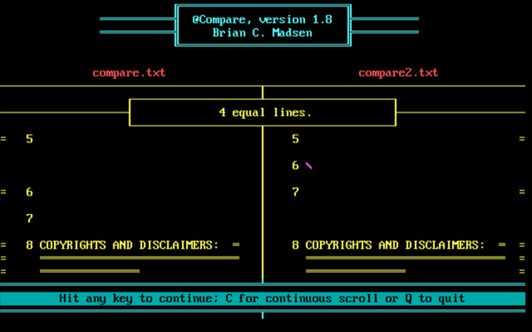
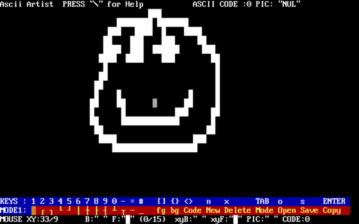
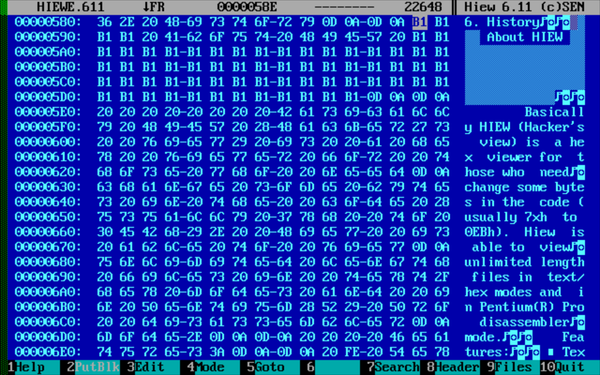

# Development: Programming languages etc.

-----

{: style="text-align:center"}
For installation instructions, please [return to General Index](README.md)

-----

Please understand: I don't actually know all these languages. Where possible, I ran the included test suites or compiled some example code. If I could find documentation, I included it. But basically you are on your own here.

-----

+ [@Compare](./zip/@compare.zip) 1.8 - A diff program for DOS by Brian C Madsen.
    + @Compare works on Ascii files which are roughly similar to each other (e.g. a .PAS and its .BAK file; a document and an earlier version of the same document; or data created via double data entry.)
    + Files to be compared may be of unlimited length.
    + @Compare matches up the two files, displaying them side by side, and displaying the similarities and differences between them.
    + Equal lines are marked by an equal sign on both sides of the screen; discrepancies in similar but unequal lines are highlighted; and lines which exist in one file and which have no corresponding counterpart in the other file are displayed as such.
    + Does not work in DOSBox. If your version of DOS does not allow executable filenames starting with "@" just rename @COMPARE.EXE to COMPARE.EXE.

+ [Aida](./zip/aida.zip) v2.14-0202 - DOS System Information Tool.
    + Detects lots of hard and soft wares, including all the latest (c. 2004) technolfogy.
    + Gives you more than other infoprogs.
    + *Updated: This 16-bit program claims to detect a multitasking environment in FreeDOS 1.2 running on bare silicon and refuses to run (it does work in DosBox). Please read NOTE.TXT in the documentation for a workaround. or see tip #2 on the [TIPS](Tips.md) page*.

+ [Agena](./zip/agena.zip) 2.16.0 - an interpreted procedural programming language.
    + Dual-licensed GPL v2 and MIT
    + A new easy-to-learn procedural programming language.
    + Suitable for scientific, mathematical, scripting, networking, and many other applications.
    + Binaries are [available](https://sourceforge.net/projects/agena/) for Solaris, Windows, Linux, OS/2, Mac OS X, Raspberry Pi and DOS.
    + Source included.
    + Under active development, so keep an eye out for updates.
    + Last updated 4 August 2019.

+ [Alice](./zip/alice.zip) - an IDE for the Alice dialect of Pascal, with a runtime interpreter.
    + Freeware by Brad Templeton.
    + This package contains all the tutorials and manuals mentioned on the [website](https://www.templetons.com/brad/alice.html), a review of the Atari ST version, and a Russian translation of the website.
    + The package defaults to the "large" version of Alice, which can use 640K of memory. The "regular" version is still there if you need it, but really, how many people are now working on a 256K system?

+ [ASIC](./zip/asic.zip) 5.0 - IDE and compiler for the ASIC dialect of BASIC.
    + Also contains two library collections for ASIC and a version of LINK.EXE that will allow linking OBJ files from these libraries into an ASIC program.
    + No-nag, non-crippled shareware by David Visti.
    + The libraries are by other authors and have their own shareware terms.
    + Code snippets are available [here](http://www.qbasicnews.com/abc/showpacket.php?packet=ASIC.ABC)

+ [AWS](./zip/aws.zip) - Create ascii art for your txt documentation.
    + Once you are fimilar with the controls, you can make amazing diagrams for your documentation.
    + There is a powerful ascii utility that allows you to view the ASCII code table, you can make scripts to display certain parts of the table rather than all of it.
    + This program is brillant for people who like to create DOS based text interface GUI screens and is good for drawing technical diagrams or ASCII art.
    + Freeware by Paul Burden.

+ **Borland** <u>Turbo Pascal 1.0 / 3.02 / 5.5</u>, <u>Turbo C++ 1.01</u>, and <u>Turbo C 2.01</u> - Available as freeware from the [Embarcadero Museum](http://edn.embarcadero.com/museum).
    + Sorry, the license does not allow me to repackage these programs.
    + You will need to register an account with Embarcadero and receive their advertising email forever to get these languages. Or you could try [10 Minute Mail](https://10minutemail.com/10MinuteMail/index.html) for a temporary email address.
    + All come with very nice IDEs. Turbo Pascal 5.5 pictured below.

+ [BSCRIPT and BATSCRPT](./zip/bscript.zip) - Two batch enhancement utilities.
    + Freeware by  Phil Sassano
    + BATSCRPT allows you to embed code from any interpreted language into a batch file - BASIC, Python, Perl, REXX etc - and execute it.
    + There is no limit to how many scripts you can put in your batch files and you can place scripts for multiple programming languages even within the same batch file!
    + BSCRIPT is a non-TSR batch file enhancer that adds abilities to a batch file, like a mini-programming language.

+ [Elan-1 Programming Environment](./zip/elan1.zip) 1.5 - Educational language based on ALGOL.
    + Elan is an educational programming language for learning and teaching systematic programming.
    + The Elan project group at the University of Nijmegen in the Netherlands has developed an Educational Programming Environment around Elan.

+ [Flisp](./zip/flisp.zip) 1.0 - A LISP implementation for DOS.
    + GNU GPL v2 by Francesco Zamblera 
    + Requires a 32-bit extender (e.g. CWSDPMI.EXE). FreeDOS has that built in already.
    + See /FDOS/DEVEL/FLISP/flisp.txt for documentation.
    + Other (untested) Lisp implementations include [Adler](./zip/adler.zip) and [PDLisp](./zip/pdlisp.zip).

+ [Hiew](./zip/hiew.zip) - Text/Hex viewer and editor.
    + Built-in Pentium(R) Pro assembler.
    + HIEW is able to create new files.
    + Search and replace mode (can be restricted to block size)/
    + Context-sensitive help (HIEW can operate without help file HIEW.HLP)
    + Search of assembler commands using pattern (for real hackers!)
    + Version 5.02 compiled for OS/2, EXE for DOS use as stub.
    + Similar programs include [Peruse](./zip/peruse.zip), [Hexed](./zip/hexed.zip), [Hexit](./zip/hexit.zip) and [Zapit](./zip/zapit.zip).

+ [Illinois Functional Programming](./zip/ifp.zip) 0.5 - An experimental functional language.

+ [Modula-2](./zip/modula2.zip) 4.0 - FST (Fitted) Modula-2 Version 4.0
    + This is the final release of FST Modula-2. It is  no more  than  a re-packaged  release 3.5.
    + The software was not changed to reflect the new release number.
    + The  only  changes   in  this   package  are   in  the documentation; specifically, the software license  changed, as shareware registration is no longer available.
    + See \FDOS\DEVEL\MODULA2\DOC\M2DOC.TXT for documentation.

+ [Moonrock](./zip/moonrock.com) 0.5 - A BASIC-like language with several extensions.
    + Produces small and tight executables. 
    + 8086, 80186+ or 80386+ code.
    + DOS real mode or DPMI protected mode.
    + Includes compiler, ArrowSoft assembler, documentation and sample programs.
    + Freeware by Rowan Crowe

+ [ Navratil Software System Information (NSSI)](./zip/nssi.zip) - system information tool.
    + A similar program is [Informer](./zip/informer.zip).

+ [Pacific C](./zip/pacific.zip) 7.51- ANSI C compiler and IDE.
    + Freeware for noncommercial use by HI-TECH Software.
    +  Pacific C combines most of the features and power of the version 7 HI-TECH C Cross Compilers into a compact, easy to use package which will run on just about any MS-DOS based personal computer.

+ [Pedit](./zip/pedit.zip) 4.00 - Programming editor.
    + Similar to the FreeDOS EDIT program, but more powerful, and with many additional features for programmers.
    + It includes pop-up tables, column support, macro key, undo, copy & paste to Windows applications, long filenames, word wrap, spell checker & thesaurus (English only, as far as I can make out), HTML support, and much more.
    + Freeware by Goldshell Digital Media.
    + In the Pedit package there's a file called PEDITLGT.EXE. This is the Light version of Pedit.  It's Pedit stripped of several options.
    + The purpose for this is to offer an editor which can easily be included on rescue floppies and such.
    + The omitted options are:
        + Spell checker.
        + Thesaurus.
        + Printing through Windows.
    + The remaining functionality is the same.
    + Also includes INSPECT, a hex editor.

+ [Rational Pilot (RAP)](./zip/rap.zip) - A batch file replacement language
    + Freeware by the Summer Institute of Linguistics.
    + It is a full-featured programming language designed for building user-friendly applications from a collection of stand-alone programs.
    + It can be viewed as a replacement for MS-DOS's batch processor which offers the following added features:
        + extensive string-handling primitives,
        + structured programming constructs,
        + built-in mechanism for displaying menus and handling user's responses,
        + and a wide range of primitives for testing the state of the file system so that user-proof programs can be written.
    + A common library of RAP subroutines is also included.

+ [SmallADA](./zip/smallada.zip) - A subset of the ADA language, with an IDE.
    + Freeware for noncommercial use by George Washington University.
    + This is a compiler/interpreter for a part of the Ada language, namely the "Pascal subset" plus the Ada tasking support.
    + It is not intended ever to be a full Ada compiler, rather a vehicle for teaching, learning, and experimenting with concurrent programming.
    + The compiler is quite fast, producing P-code which is then interpreted by the interpreter.
    + The entire system runs in RAM with no disk accesses, so expect capacity to be limited. 250 statements or so can be safely accommodated.
    + The current version is not particularly robust, rather it is a preliminary step toward effective window-oriented monitoring of task execution.

+ [SNOBOL 4](./zip/snobol.zip) - A freeware implementation of the SNOBOL language by Gordon E Peterson II.

+ [VT Prolog](./zip/vtprolog.zip) - Very Tiny Prolog.
    + A  simple PROLOG interpreter provided to encourage experimentation with PROLOG.

+ [XLisp](./zip/xlisp.zip) 2.0 - An Object-oriented Lisp.
    + Free for noncommercial use.
    + XLISP is an experimental programming language combining some of the features of Common Lisp with an object-oriented extension capability.
    + It was implemented to allow experimentation with object-oriented programming on small computers.

-----

{: style="text-align:center"}
For installation instructions, please [return to General Index](README.md)

-----
