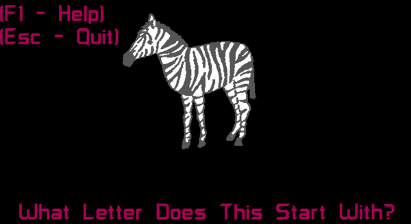
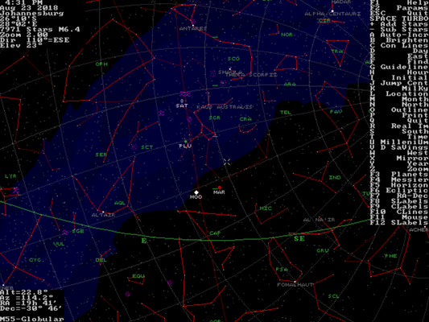

# Educational programs
-----

{: style="text-align:center"}
For installation instructions, please [return to General Index](README.md)

-----

+ [Animated Alphabet](./zip/aalpha.zip) - Combines colorful graphics with appealing animation to teach the letters of the alphabet.
    + Designed for children from pre-school to the first grade.
    + requires 640K memory, EGA and a hard drive.
    + Shareware by Tom Guthery IV.

+ [Elan-1 Programming Environment](./zip/elan1.zip) 1.5 - Educational language based on ALGOL.
    + Elan is an educational programming language for learning and teaching systematic programming.
    + The Elan project group at the University of Nijmegen in the Netherlands has developed an Educational Programming Environment around Elan.

+ [SkyGlobe](./zip/skyglobe.zip) 3.6 - Award-winning Top Ten PC planetarium program
    + SkyGlobe has over 29,000 stars, constellation lines, the planets, Sun and Moon, the Milky Way, the Messier Objects, and much more.
    + It is the fastest program of its kind available, and uses the mouse or convenient command keys. 
    + With GIF image display, and support for up to 250,000 stars!

-----

{: style="text-align:center"}
For installation instructions, please [return to General Index](README.md)

-----
