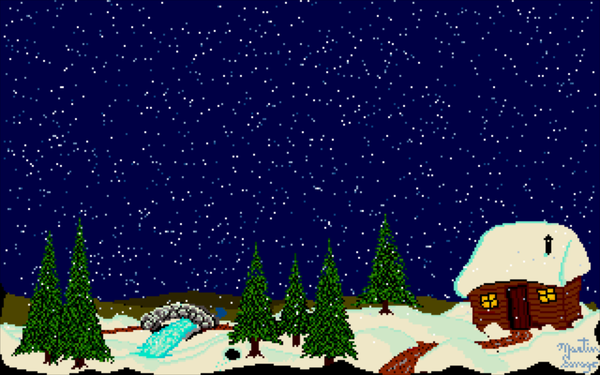
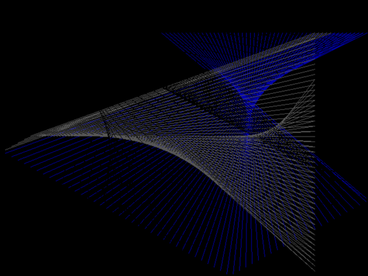
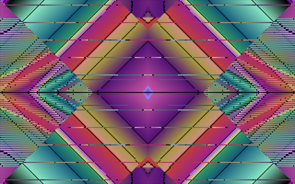
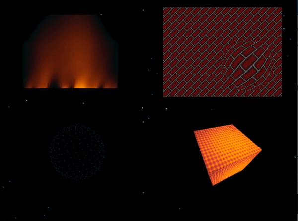
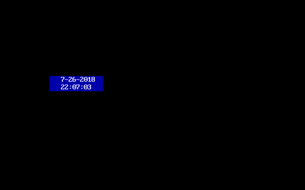
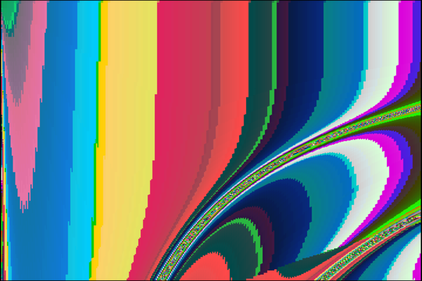

# Eye Candy

-----

{: style="text-align:center"}
[Return to General Index](README.md)

-----

NOTE: These programs are NOT memory-resident. They are regular .COM or .EXE programs.

+ [Acid Warp 4.2](./zip/acidwarp.zip) - Run it and watch the pretty colors.
    + Free Software by [Noah Spurrier](http://www.noah.org/acidwarp/).
    + *CTRL-Break* exits the program, If your keyboard does not have a *Break* key, *CTRL-C* also works ... eventually. You may have to hit it a few times.
    + Source code included, but it is marked as "private proprietary source code" (see *ACIDWARP.C*), so I guess that is for inspiration only.

+ [DeciMatrix](./zip/dcmatrix.zip) - Matrix-like screensaver.
    +  © [Bruno Félix Rezende Ribeiro](https://oitofelix.github.io), released under GNU GPL v3.
    + DeciMatrix is a program designed to decode the Matrix into decimal.
    + It works with CGA, EGA and VGA graphic adapters and it runs on any IBM-PC compatible, the minimum requirement being an 8086 processor with 16Kb of RAM.
    + It is based on the premise that it’s easier for people to become proficient in interpreting the Matrix code if instead of dealing with very cryptic symbols rolling down in the screen, they could deal with static and familiar symbols.
    + It’s still quite hard to learn how to see through the code, though; but don’t worry — if you happen to never see the woman in red, at least you’ll have used a very cool DOS screen-saver.
    + **Packager's note**: DCMATRIX does not clean up the screen mode after it closes, so you may want to issue a MODE CO80 afterwards.

+ [Hiver](./zip/hiver.zip) - animated winter scene screensaver.
    + Freeware by Martin Savage.
    + Please see the documentation - you may need to slow this one down on modern hardware.

+ [Laser](./zip/laser.zip) - Possibly the original that has since appeared on every possible Operating system.
    + Public Domain (?) by John Horemans. 
    + Turbo Pascal code included

+ [Rave](./zip/rave.zip) 1.1 - Kaleidoscope emulator.
    + Generates and displays kaleidoscopic patterns with color palette "cycling" on 80x86 class computers equipped with VGA or SVGA graphics adapters and displays.
    + In addition to the default automatic mode, limited user interaction is available via the keyboard to control various drawing parameters.
    + Freeware by J Ashley Roeckelein.

+ [The Stary's screensavers](./zip/strss.zip) - A collection of five screensavers in EXE format.
    + BULGE, DOTTY, FLAMES, FURNACE and STRFIELD. 
    + Can also be used in DOS NAVIGATOR: see the documentation.
    + Freeware by Wojciech Dzierzanowski.

+ [TimeBox](./zip/timebox.zip) - Time and date display screensaver.
    + Author unknown.

+ [VGA Art](./zip/vgaart.zip) - More demo than screensaver, with annoying ad screens at both ends.

-----

{: style="text-align:center"}
[Return to General Index](README.md)

-----
