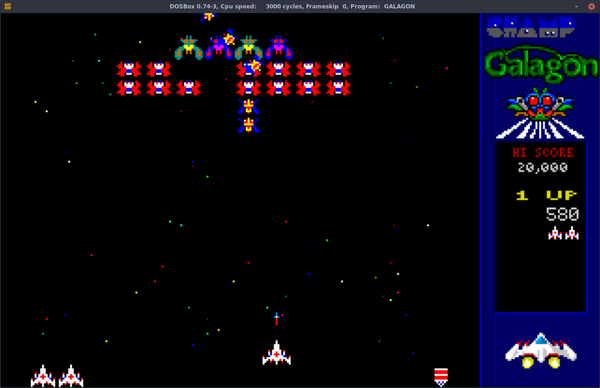
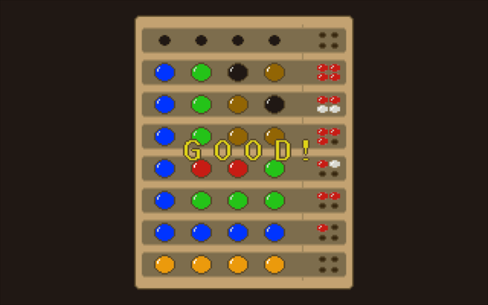
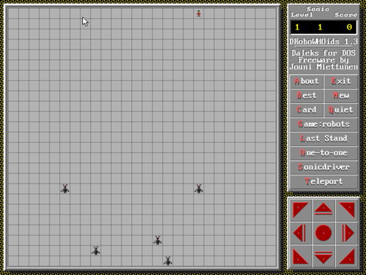
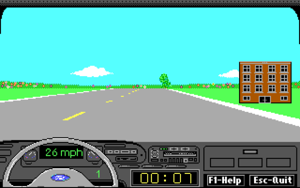
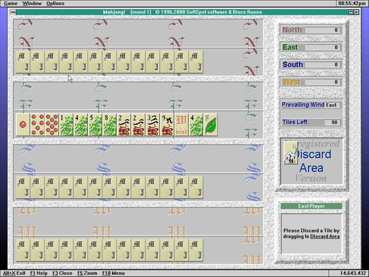
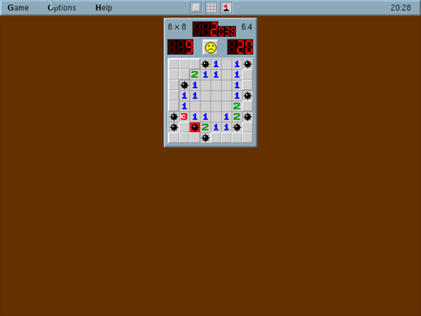
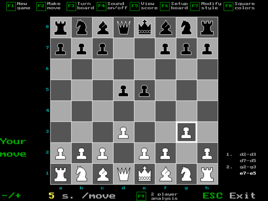
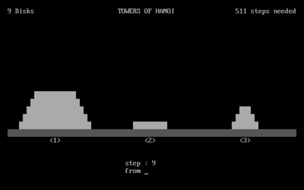

# Games

-----

{: style="text-align:center"}
For installation instructions, please [return to General Index](README.md)

-----

Prepare to be disappointed. I am not a gamer AT ALL and I only put a few of the most simple little games up here. This is the least developed section of the repository and probably always will be.

+ [Champ Galagon](./zip/galagon.zip) - A Galaga clone
    + You know how to play Galaga
    + A bit slow under emulation.

+ [Dr Mind Lite](./zip/drlite.zip) - A Mastermind clone
    + Dr. Mind is a PC adaptation of the Mastermind (TM) board game. The computer generates a secret color code, then the player has to figure out the exact pattern through deduction.
    + Keyboard controls: arrows, return and escape. TIP: The UP arrow key cycles through colors.
    + The game comes in two versions: the normal release and a "LITE" variant. The LITE version is the same thing, but with pictures removed - may be handy for computers that have extremely limited storage.
    + This package ONLY contains the lite version.

+ [Drobos](./zip/drobos.zip) - Daleks for DOS
    + You find  yourself on an open field surrounded  by hordes of hostile creatures.
    + You have no weapons, no cover, nowhere to run, no future.
    + Let's face it,  you  already  lost!
    + ALL you have is your brilliant mind to REVENGE your coming annihilation.
    + Freeware.

+ [Ford Driving Simulator](./zip/ford.zip)
    + If you weren't able to visit your local Ford dealer, you could test drive several Ford models on your computer. 
    + This was meant as a car driving simulator, not a game - but it certainly played like a game.
    + Also has stats and details about Ford's 1988 models.

+ [Life2](./zip/life2.zip) - A text-mode version of Conway's Game of Life.

+ [Mahjong!](./zip/mahjong.zip) -  Based on the popular Chinese tile game Mahjong and attempts to closely approximate play of that game on your PC.
    + Shareware.

+ [Mine Mayhem](./zip/minemay.zip)  - Minesweeper clone.
    + Freeware by Jason Hood.

+ [Nero 5](./zip/nero5.zip) - Chess program.
    + Move your pieces with ARROW KEYS and ENTER.
    + During play Nero writes down the played moves into the file 'WEPLAYED.TXT' so you can watch them later (or view with some PGN reading program.)

+ [ShuffleV](./zip/shufflev.zip) 1.1 - Tile shuffling game.
    + Freeware for non-commercial purposes by J R Ferguson.
    + Click a number joining the empty field to shift it, or use the cursor keys.
    + Order  the numbers from low to high, in rows left to right and columns top to bottom. The empty field must be in the lower-right corner.

+ [Towers of Hanoi](./zip/hanoi.zip) 1.3 
    + Freeware by J R Ferguson
    + A classical recursive algorithm for which a  'legend'  was thought  up.  In Hanoi there would be monks that have a sheer inhuman task: Nine stone disks, all with a different diameter and a hole in  the  middle, are  piled on a pole, the smallest op top. Two more poles are placed beside it. The task consists  of  moving  all  disks  from  the  leftmost  to  the rightmost pole, using the middle pole as a place to store disks in-between.
    + There are two rules that must be observed:
        + Only one disk can be moved at a time.
        + Never place a disk on top of one that is smaller.
    + According to the legend, the world will be at end when this task is done.

+ [TypeFast](./zip/typefast.zip) - a text mode Typing tutor game.
    + It's a GAME (not boring drills) that's a cross between a touch-typing program and "Space Invaders".
    + Words appear in random places on the screen and slowly move down.
    + You have to type them correctly to blow them up before they reach the "ground" (a line at the bottom of the screen).
    + There are several degrees of difficulty.

-----

{: style="text-align:center"}
For installation instructions, please [return to General Index](README.md)

-----
