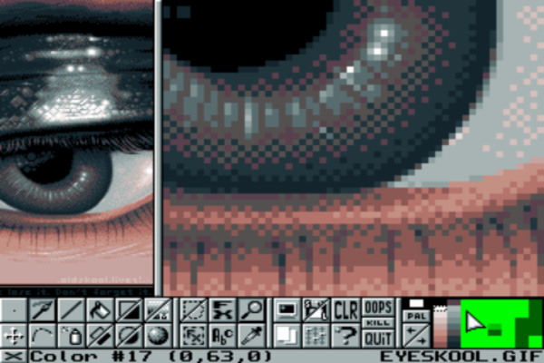
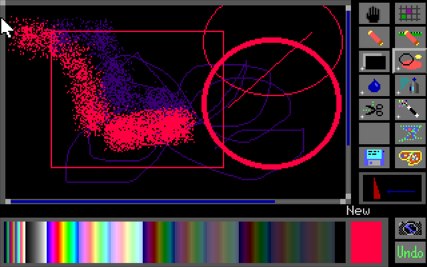
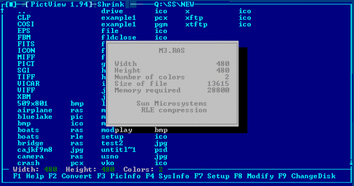

# Graphics applications

-----

{: style="text-align:center"}
For installation instructions, please [return to General Index](README.md)

-----

+ [Animator](./zip/animator.zip) - (AKA Autodesk Animator, Video Paint, or simply V) is a 256 color paint and animation package.
    + BSD licensed.
    + See the [Home page](http://animatorpro.org) and the GitHub [code repository](https://github.com/AnimatorPro/Animator-Pro). 

+ [GrafX2](./zip/grafx2.zip) 2.0 beta 96.5%. - 256-colour bitmap editor.
    + Released as shareware, but the source was [GPL'ed a year later](https://web.archive.org/web/20071213221524/http://code.google.com/p/grafx2/wiki/FreeSoftwareRelease).
    + Lots of hotkeys, all reconfigurable with GFXCFG.EXE.
    + The batch file \FDOS\LINKS\GRAFX2.BAT defaults to a resolution that works well with my 1024X600 laptop screen. If that does not work for you, run GRFX2 /? from the program directory and change the "32" on the last line of the batch file to something that does.
    + You can also change the resolution inside the program. If you hit an unsupported resolution and get a screen full of gibberish, SHIFT-ENTER gets you back to a safe default.

+ [LxPic](./zip/lxpic.zip) v7.3 - Graphics viewer.
    + Freeware by Stefan Peichl.
    + LxPic is a very small, powerful and fast DOS picture viewer.
    + It has just 20 KB code and runs in 64 KB of memory on any 8086 compatible computer. It supports all display modes from early CGA up to the latest 2048x1536 QXGA True Color (32bit) screens.
    + LxPic processes BMP, PCX, JPG and GIF files of any kind. BMP and PCX files may have 2, 4, 256 or True Colors (16 Million). JPG files may have 256 gray scales or True Colors. GIF files may have Version 87a or 89a (including multi images) with up to 256 colors.

+ [MVP Paint](./zip/mvppaint.zip) - Graphics editor.
    + Shareware by MVP Software
    + MVP Paint is a full-featured graphics workshop.
    + With MVP Paint you can easily create or modify graphics or animation files. 
    + It supports a variety of advanced features, and has been used to develop two MVP Software games, Sand Storm and Corncob 3D.
    + Originally created as an in-house game development tool, it has been tested extensively in real-world applications.

+ [OGE](./zip/oge.zip) - Bitmap editor.
    + All documentation in Czech (I think).
    + Works in DOSBox, but crashes on real silicon.
    + GNU GPL v2.

+ [PictView](./zip/pictview.zip)1.94 - A mouse-driven viewer and converter of images.
    + It runs on all EGA, VGA,  SuperVGA and  Extended VGA  video  adapters.
    + PictView is able to read images  stored in approximately  40 graphics file formats and convert them into  another format.
    + It can also resize images and change the colour depth.
    + Freeware by [Jan Patera](http://www.pictview.com).

-----

{: style="text-align:center"}
For installation instructions, please [return to General Index](README.md)

-----
