# Program launchers, file managers and environments

-----

{: style="text-align:center"}
For installation instructions, please [return to General Index](README.md)

-----

+ <u>Access</u> (aka <u>XX</u>) - A menu program. It runs your applications and games.
    + Freeware by Ronald Blankendaal.
    + Access is especially suitable for people that are still using DOS, but do not endorse the command prompt and its limitations.
    + Access tries to overcome its most important annoyances. For example, in DOS, when a user wants to run a program, he or she would have to move to the appropriate directory on the disk first. Access will search for a program's location fully automatically.
    + Another important feature of Access is its simple user-friendly interface.
    + Straightforward, good-looking and customizable.
+ **Version 3.01**
    + This version is non-graphical and works fine on a 8088!
    + Packager's note: this is the one I use myself.
    + **Downloads:**
        + [English](./zip/xx3en.zip)
        + [Nederlands](./zip/xx3nl.zip)

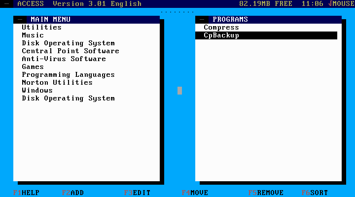  

+ **Version 4.60**
    + This is a complete rewrite and uses a graphical rather than a text interface.
    + It comes with a large collection of icons and Windows icons can be added with a standalone program.
    + **Downloads:**
        + [English](./zip/xx4en.zip)
        + [Nederlands](./zip/xx4nl.zip)

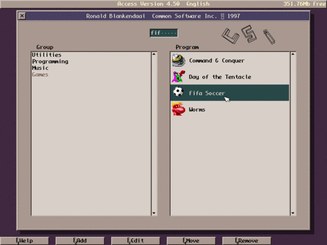

+ **Version 5.0**
    + Packager's note: Pre-release versions of Access v5 exist. I find them too buggy to package, but if you want to try, it can be downloaded at [http://members.quicknet.nl/blankendaalr/](http://members.quicknet.nl/blankendaalr/)
+ The following features are shared by all Access versions.
    + Takes no memory while running programs! No matter whether you start a program directly from DOS or from within Access, you will have exactly the same amount of conventional memory left.
    + Can store an unlimited number or programs and program groups, only limited by the amount of available free memory.
    + Has full mouse support.
    + Has an advanced feature called 'QuickKey' that can help you search for a program in the menu.
    + Supports both English and Dutch (Nederlands) in full.

+ [Adrenal Manager](./zip/amanager.zip) 1.32 - A graphical file manager.
    + Freeware by Jani Vuorinen.
    + After installation, edit amanager.cfg to add the location of the helper programs.


+ [Desktop 2](./zip/dsk2e.zip), also available in [German](./zip/dsk2g.zip)
    + Freeware by [Felix Ritter](http://www.mevis-research.de/~ritter/awakeideas/desktop.html).
    + DESKTOP is somewhat in the middle between MS-Windows and Norton Commander.
    + Hierarchical program manager.
    + Sophisticated file manager.
    + Block-oriented editor.
    + The inevitable CD player.
    + Calculator.
    + Screen savers.
    + Config tool.

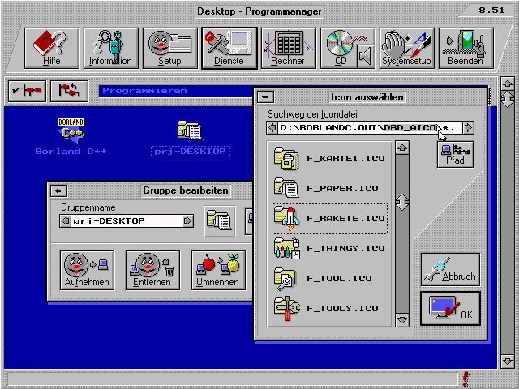

+ [DMenu](./zip/dmenu.zip)- a small graphical menu program.
    + It is limited to 10 categories with 10 items in each.
    + To create a menu, simply call "menugen.exe", or edit the sample MENU.INI file, it really is quite a simple structure.
    + For most games and programs, you will have to create a batch file to cd into their install directories. Of course, if it is a program from this repository, just use the batch file in \FDOS\LINKS (You see, there is method in my madness!).
    + To start, please run dmenu.bat
    + DMenu is skinnable. Simply replace the .png files with your own to create a skin.
    + Source: [Sourceforge](https://sourceforge.net/projects/dmenu/)

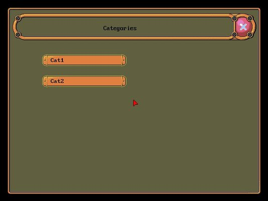


+ [EXE](./zip/exe.zip) - Text-based launcher.
    + This program is useful to handle executable files, just type EXE and it lists all files colored by extensions, white for folders, yellow for EXE, COM and BAT.
    + You also can type the 1st letter to go to the file.
    + Extensions recognized: Compressed files, graphics, movies, sound, text, etc.
    + Type . for CD.. and type \ to go to root.
    + Use UP, DOWN, PAGE UP, PAGE DOWN, Home and End to navigate the list.
    + You can run, delete, sort and view files.
    + You may also set the variable PPEXE with your default parameters.

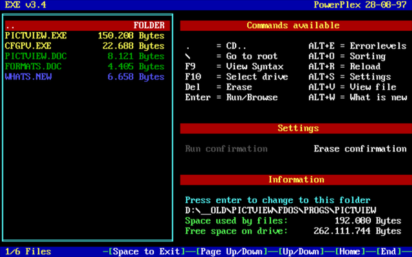

+ [ExeMenu](./zip/exemenu.zip) - Simple menuing system.
    + THIS WILL OVERWRITE THE EXEMENU THAT COMES WITH FREEDOS! And I'm OK with that. It is a much more versatile program.
    + Free software by J C Kessels. Source included.
    + EXEMENU will display a menu with all the programs in a directory.
    + You select one with the cursor or character keys, and press Enter.....the program is started. 
    + When you quit the program, you automatically return to the EXEMENU.
    + EXEMENU is designed to be used by the non-tech user. Power users have Norton-Commander, PC-tools, and many more. But I have frequently found those packages to be too complicated for the majority of the PC users!Therefore EXEMENU has:
        + No documentation (well, almost). Run and use!
        + No settings.
        + No function keys.
        + No mouse.
        + No pull-down or pop-up menu's.
        + Easy screen layout.
        + Zero installation: it will run anywhere.
    + EXEMENU recognises EXE, COM, BAT and BAS programs.
    + You only see programs that can be started (lowercase), and subdirectories (uppercase). Nothing else.
    + BAS programs (Basic) will only be visible and can only be started if a basic interpreter is found in the path when EXEMENU is started:GWBASIC.EXE, GWBASIC.COM, BASIC.EXE, BASIC.COM, BASICA.EXE, or BASICA.COM.
    + You can optionally specify a path with EXEMENU:
````
EXEMENU C:\FDOS\LINKS
````
+ 
    + This will cause EXEMENU to startup with that path.
    + If you don't specify a path, then EXEMENU will startup with the current directory.

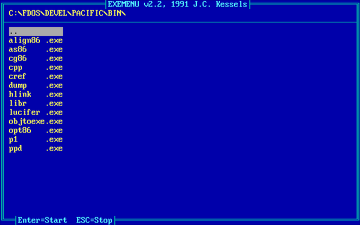

+ [IBM Handshaker (Connect)](./zip/cn.zip) - A DOS shell in a class of its own.
    + File Manager: Movable, sizable, and iconize-able directory panels
    + Drag and drop copy and move capability.
    + One prominent feature is the "unfold subdirectories" option which allows you to display a single virtual directory of files contained in multiple selected directories and their subdirectories. 
    + Connect displays popular archives as directories, displays file descriptions, and has Win9x LFN and clipboard support. 
    + Includes a good file finder which can search in archives.
    + Viewers for text, dbase, and html (with hyperlink navigation).
    Impressive text editor handles large files; permits multi-file text search / replace with regular expressions. Capable of Drag and Drop of text between *different* editing windows.
    + Capable hex editor (can hex-edit multiple files).
    + Other: VT100 terminal (with X-, Y-, Z-modem, Kermit protocol support), phonebook, dialer, alarm, print spooler, CD player, programming features, and lots more.
    + Y2K compliant.
    + Freeware.
    + But ... unfortunately the help files are only in Russian. And it is a big, complicated program. It will take a while to get everything set up.

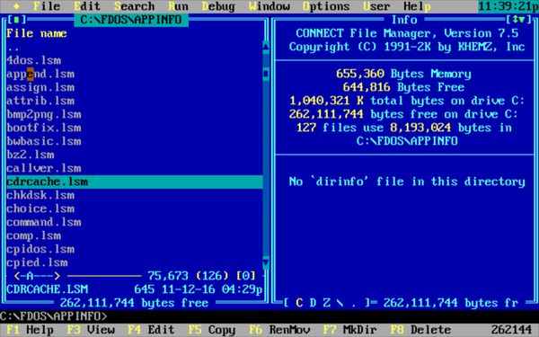

+ [LCARS24](./zip/LCARS24.zip) - Emulates the look and feel of a certain well-known science fiction computer system.
    + Get your sound card working before you install this.
    + Originally from [SourceForge](https://sourceforge.net/projects/lcars24/).
    + GPL v2, source included.

[](https://www.youtube.com/watch?v=Uoho7-vGigM "LCARS 24 - click to play")

+ [Menu X](./zip/menux.zip) - Simple menuing system.
    + Freeware by Yijun Ding.
    The MENUX.COM program itself is all you need to setup a menu system.
    + The first time, you type "menux" to create a batch file MENU.BAT, which will reside in the same directory as MENUX.COM.
    + From now on, you can use or update your menu system by typing "menu".
    + You may also want to use the built in screen saver feature. Type "menux 3" to setup to blank the screen after 3 minutes of inactivity of keyboard.  This is usually done when you first run "menux". 
    + You can also choose to use a different menu name like UTILS, SYSTEM etc. For example, you would like the menu system to be activated by the command "utils" (batch file name UTILS.BAT), just rename or copy MENUX.COM to UTILSX.COM and follow the above instructions.
    + Packager's note: The first time I ran this it would only respond to the RIGHT Control key. The [problem miraculously disappeared when I started running it from the batch file.

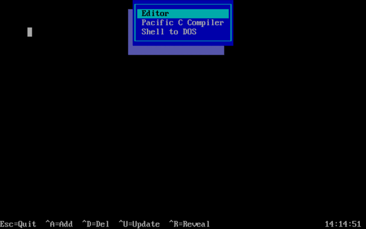


+ [PowerMenu](./zip/powrmenu.zip) - Simple menu system.
    + Freeware for noncommercial use by Jem E Berkes.
    +  This menu system presents a colorful text mode program list which the user can scroll through with a lightbar.
    + Leaves a 1 KB stub in RAM. 

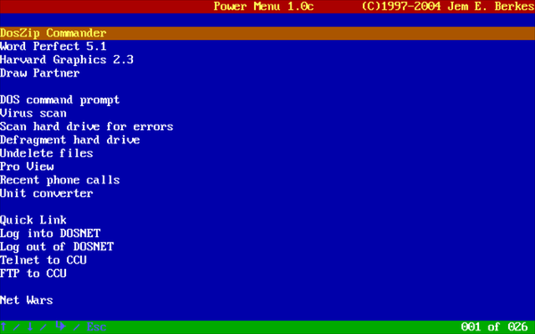

+ [Spectra](./zip/spectra.zip) - A very powerful GUI
file manager for DOS with many customizable skins.
    + Freeware by HiTech Laboratories.
    + Supports ZIP, RAR, ARJ, PAK and LHA compression and has the ability to treat ZIP files as directories.
    + An excellent extension registration system enables the user to perform unique operations, such as assigning multiple programs to a single extension.
    + Many utilities are available for drive, system and memory information, as well as utilities for printing documents.

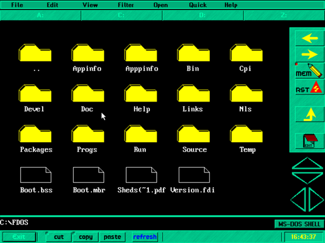

+ [XGUI](./zip/xgui.zip) - Run multiple "xterms"
    + This oddity is v..e..r..y slow, and is included here mainly for interest's sake, but the source code is included, so there is hope ...

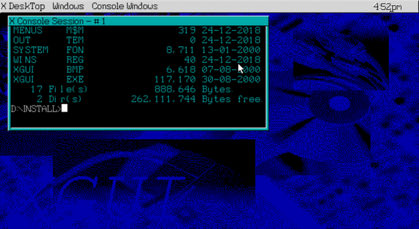

-----

{: style="text-align:center"}
For installation instructions, please [return to General Index](README.md)

-----
