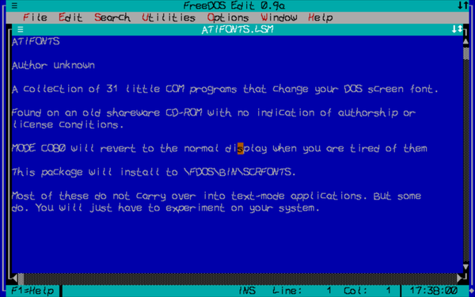
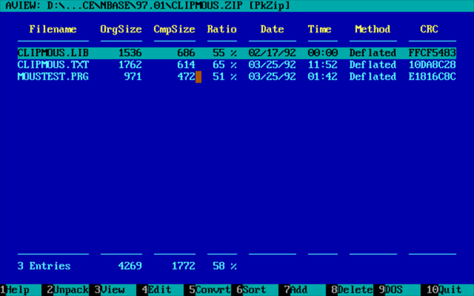
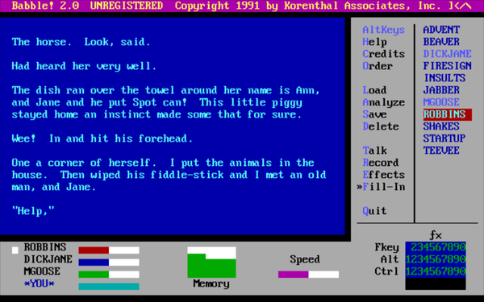
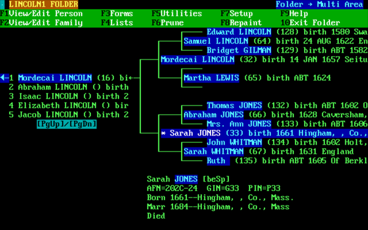
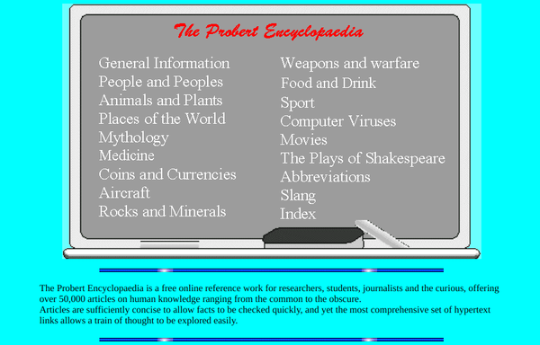
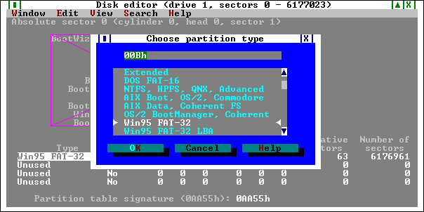

# Miscellaneous

-----

{: style="text-align:center"}
For installation instructions, please [return to General Index](README.md)

-----

+ [ATI Fonts](./zip/atifonts.zip)- 33 little COM programs that change your DOS screen font.
    + Found on an old shareware CD-ROM with no indication of authorship or license conditions.
    + MODE CO80 will revert to the normal display when you are tired of them.
    + This package will install to \FDOS\BIN\SCRFONTS.
    + Most of these do not carry over into text-mode applications. But some do. You will just have to experiment on your system.
````
C:
CD \FDOS\BIN
.\SCRFONTS\SCRIBBLE.COM
EDIT ..\APPINFO\ATIFONTS.LSM
````



+ [Aview](./zip/aview.zip) V4.8 Beta-D - The Norton Commander Archive Viewer.
    + A small utility to manipulate, extract and convert ARC, ARJ, HYP, LZH, PAK, RAR, SQZ, UC2, ZIP and ZOO files.
    + Lots of options, can be fully mouse-operated, very easy to use.
    + This package also includes an overlayed version of AVIEW (uses a bit less memory) and two utilities to integrate it into Norton Commander.
    + Can also be used as stand-alone utility.
    + Requires external de/archiver utilities - please see the documentation.
    + Freeware.



+ [Babble!](./zip/babble.zip) - Randomize and rearrange text.
    + Shareware from Korenthal Associates
    + Babble! is a toy for people who love words.
    + Babble! takes samples of text from various sources, analyzes them for style and content, mixes them together in varying proportions, and then...well...*babbles*.
    + On and on. Endlessly. If you take its samples away, it still babbles. That's what Babble! does. It babbles!
    + By mixing up words and ideas, and by finding connections which are not obvious to the naked mind, Babble! is useful as a creative tool and as a cure for writer's block.



+ [BigText](./zip/bigtext.zip) by Kevin Solway- Create self-displaying illustrated books & manuals.
    + A suite of programs that turns ordinary text files into self-contained, self- displaying executable files capable of displaying full colour illustrations in body of the text.
    + This program is specifically designed to make self-displaying books, manuals, documents, and catalogues.
    + The difference between Bigtext and similar programs is that it can handle genuinely BIG volumes of text (up to 700kb or more) and that it creates a single, neat and convenient executable file.
    + Ignore all the shareware documentation: according to the [website](http://www.theabsolute.net/sware/oldfav.html) this is now freeware.


+ [Crossword Helper](./zip/wordfind.zip) - *WORDFIND* helps you solve crossword puzzles.
    + Freeware by Dale Harris.


+ [ Genealogical Information Manager](./zip/gim.zip) 3.19
    + Shareware (nag-free AFAICT) by D. Blaine Wasden and Brian C. Madsen
    + Provides all of the basic features of traditional genealogical database managers, plus many new features not available from any other product.
    + GIM is fast and powerful, yet intuitive and easy to learn.
    + This archive contains executables and documentation.



+ [Mr Double Scan](./zip/mr2s.zip) 1.13.01 - Anti Virus Scanner
    + Mr2S detects more than 36.000 different viruses, including mIRC, Bat, Win, Polys VBS (VBS.Loveletter:), Macro, DOS and Boot viruses.
    + Freeware from Gega Software, Andreas Haak and ROSE SWE.
    + Released: 17-Sept-2000
    + Usage:  *mr2s drive:\path2scan log.file*

+ [Probert](./zip/probert.zip) - Offline encyclopaedia.
    + This is the FREE Probert Encyclopaedia in HTML format.
    + Simply unzip the contents to C:\ and point your browser (Dillo, Arachne) or text-mode HTML viewer at \FDOS\DOCS\PROBERT\INDEX.HTM
    + Freeware by [Matthew Probert](probertm@pins.co.uk)



+ [PTS Disk Editor](./zip/ptsde.zip) - Advanced hex editor and partition rescue program.
    + PTS DiskEditor is a program that allows you direct viewing and editing of hard drives.
    + This may be useful in various situations, for example, in order to rescue important information from damaged drives or logical disks.
    + A similar program is [The Partition Resizer](./zip/presize.zip).



-----

{: style="text-align:center"}
For installation instructions, please [return to General Index](README.md)

-----
