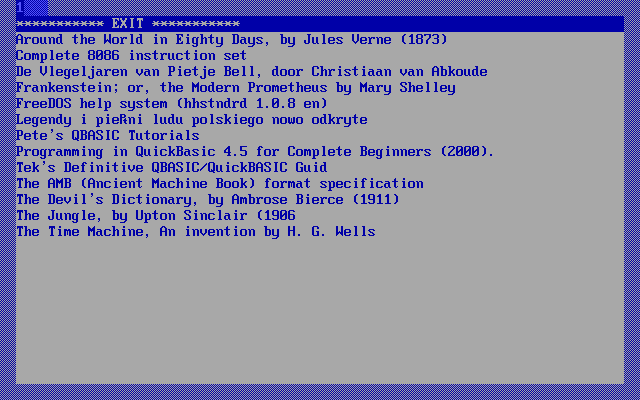
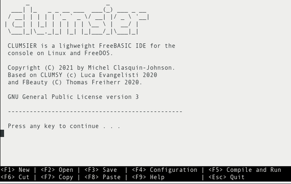

# My FreeDOS applications
-----

{: style="text-align:center"}
These apps are not packaged like the rest on this site. Links go to the github repositories. Some have binaries available, others, not so much.

[return to General Index](README.md)

-----

+ [Amb-Utils](https://github.com/clasqm/amb-utils) - Small FreeDOS utilities for Mateusz Viste's AMB ([Ancient Machine Book](http://amb.osdn.io/)) e-book format.
    + The AMB and AMBPACK utilities are prerequisites.
    + Ambrary - a simple launcher menu for your .AMB files.
    + Ambtitle - Indexes your AMB files so that Ambrary can display them as tiels rather than filenames.
     * A small collection of AMB files.

+ [Clumsier](https://github.com/clasqm/clumsy/tree/clasqm) - a lightweight FreeBASIC IDE for console on FreeDOS or Linux, written in FreeBASIC itself.
    * Requires FreeBASIC to compile it.

+ [LN](https://github.com/clasqm/FakeLN4DOS) - A fake symlink creator for DOS
    + LN for DOS approximates the symlink command on UNIX-like operating systems by creating batch files.
    + Requires QuickBASIC 4.5/PDS 7.1 or FreeBASIC to compile it.

+ [QBASDOWN](https://github.com/clasqm/QBASDOWN) - a Markdown implementation for FreeDOS.
    + Written for FreeDOS in QuickBASIC 4.5.
    + QBASDOWN is distributed as QuickBASIC source code and released as a single OS executable, called *QBASDOWN.EXE*.
    + A 64-bit Linux version is also available.
    + The long-term goal is to implement all of Gruber's original Markdown, plus selected extensions from MultiMarkdown and other developments, a few modest ideas of my own, and some prettyprinting. Technically, I suppose that means I am inventing a new dialect of Markdown. Fame at last!

