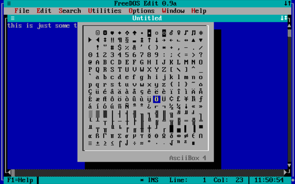

# Terminate-and-stay-resident utilities

-----

{: style="text-align:center"}
For installation instructions, please [return to General Index](README.md)

-----

Not a priority, sorry. These things can crash your system mightily if you invoke them while in the wrong screen mode. 

Still, if and when I do find some that are sufficiently robust and useful, I will post them here. The program I use to test  them in graphics mode is [Adobe Acrobat for DOS](./zip/acrodos.zip). If they do nothing in Acrobat when the hotkey is pressed, they get posted here. But test them with any graphical programs you use!

+ [ASCII Box](./zip/asciibox.zip) - Displays a table of the 256 ASCII characters, which it can insert into DOS/ASCII text.
    + The command ASCIIBOX loads it into memory.Then, at the DOS prompt or in a document opened under another program, place the cursor where you want a character written.
    + Then press F12 to call up the table, and use the navigation keys to move the cursor to the character you want.
    + Press Enter to write the 
character, and clear the table from the screen. Press Esc to clear the table without making a selection.
    + Press F11 at any time to repeat writing of the last character selected, without calling up the table.
    + Freeware by Pawel Boguslawski.

+ [ClockOn](./zip/clockon.zip) - Screen Resident Clock
    + There are a lot of little TSRs to print the time in the top-left corner of your screen. CLOCKON is the best at going away in graphics mode, then coming back in text mode again - it  will  not  write  if the screen is in any graphics mode or 40 column mode.
    + Up to nine alarms, which work even if CLOCKON is not visible.
    + Works fine from high memory with LH.
    + The author (H.J. Harvey) says there is an incompatibility with MS Word 5. I have not replicated this error in MS Word 5.5.

-----

{: style="text-align:center"}
For installation instructions, please [return to General Index](README.md)

-----
